# winhec-demo

This is a demo platform for WinHEC intended to run on a NXP RT685-EVK board.
It expects a TMP108 sensor breakout board and 5v 4-wire PWM fan connected to the board (see below for setup instructions).

## Hardware
Ensure you have three components:

### NXP RT685-EVK with Micro-B to Type-A USB Cable
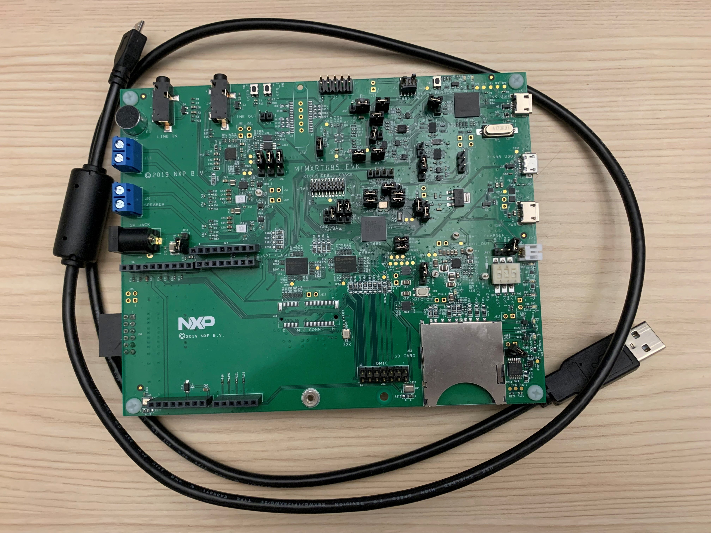

### TMP108 breakout board with 4 female-to-male jumper wires
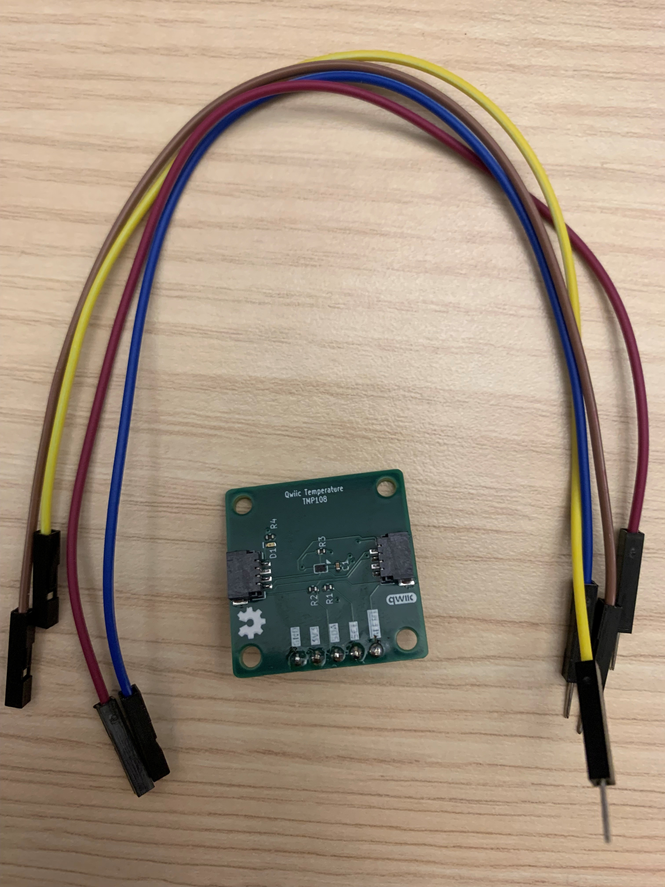

### 5v 4-wire PWM fan with 4 male-to-male jumper wires
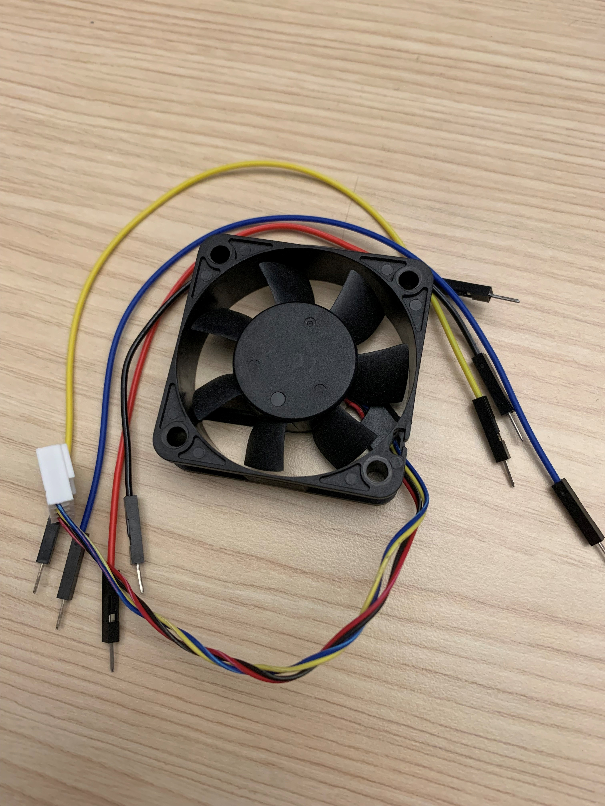

## Sensor Setup
Connect the female ends of the 4 female-to-male jumper wires to the male header pins of the TMP108 board.  
From the perspective in the image below, this corresponds to the 4 left most pins (the 5th rightmost pin should be left floating).  
This corresponds to GND, 3V3, SDA, SCL starting from the left.  
I will reference the colors I show in the image but coloring doesn't matter as long as you remain consistent.
I am using brown for GND, violet for 3V3, blue for SDA, and yellow for SCL.
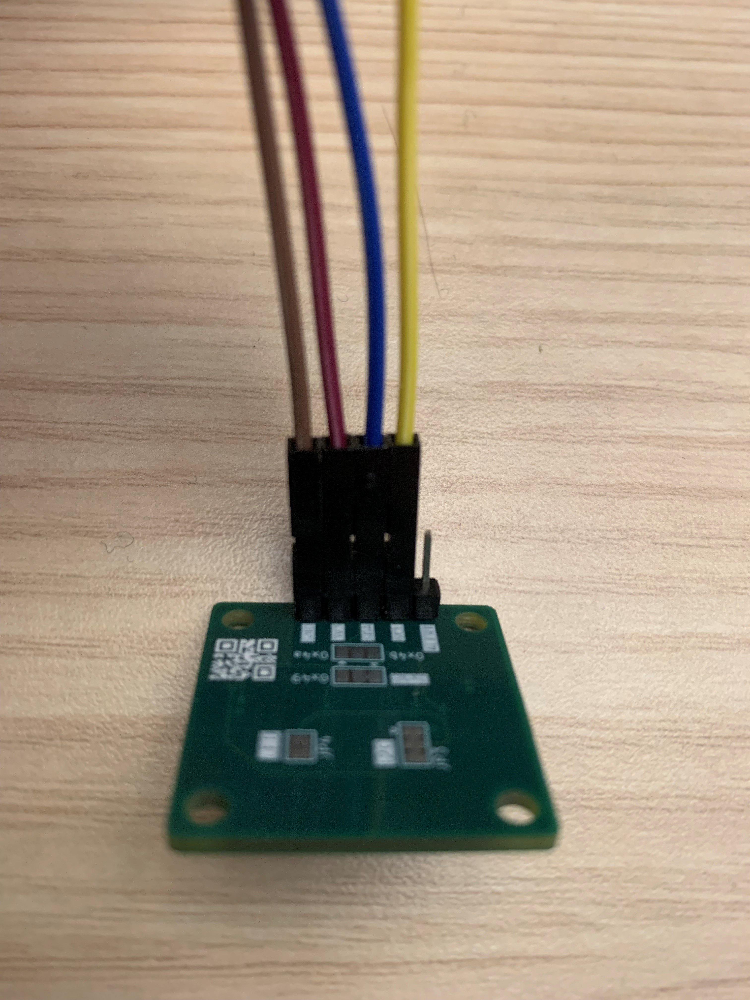

Now connect the male ends to the female J28 header of the RT685-EVK starting at the left most slot in the order shown below.  
So based on the color coding I'm using above, the order below (from left to right) corresponds to SCL, SDA, 3V3, GND.
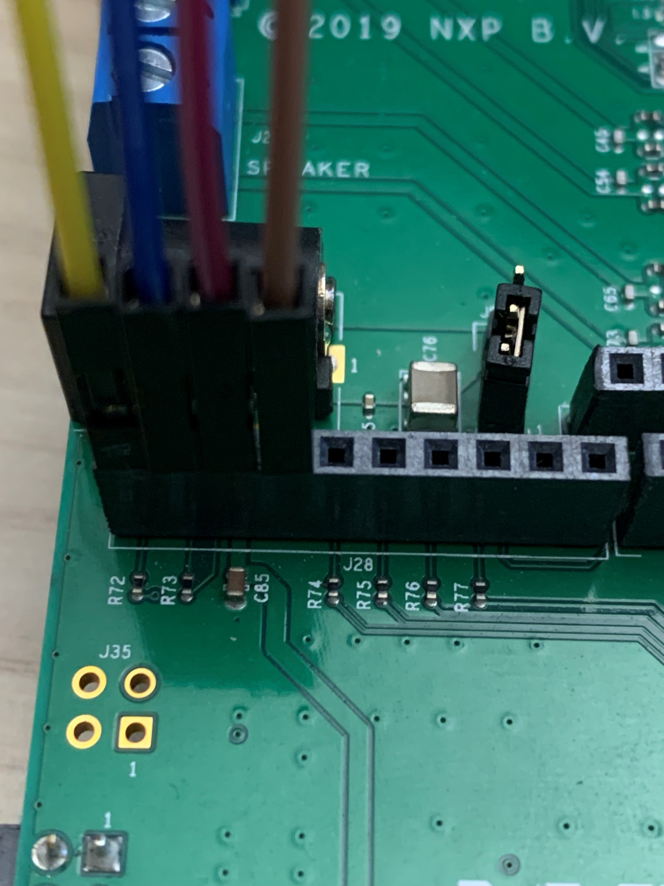

## Fan Setup
Connect 4 ends of the male-to-male jumper wires into the female fan connector.  
Again coloring doesn't matter as long as you are consistent but I just match my jumper wire colors to the fan connector colors:
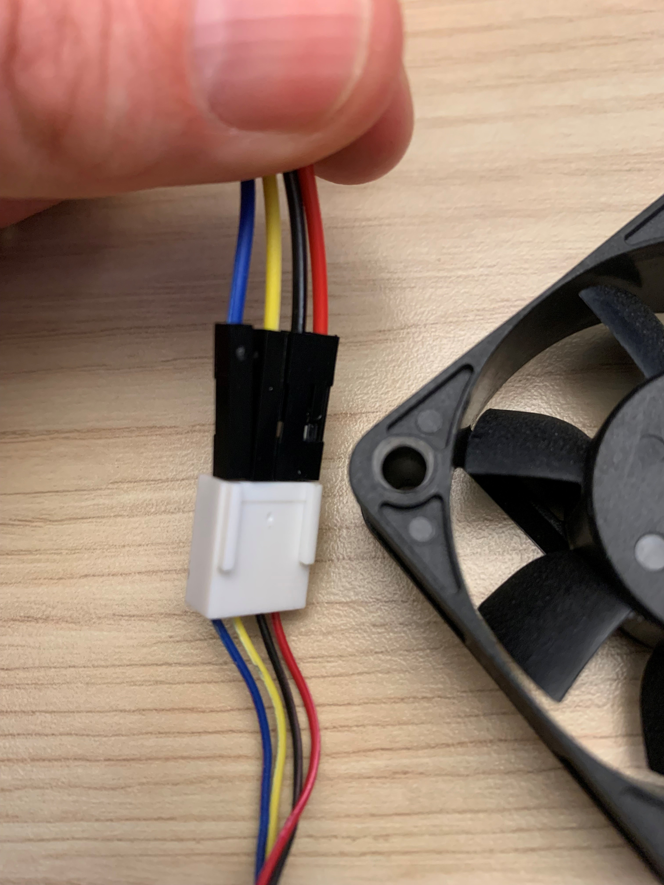

Now connect the yellow wire (tachometer) and blue wire (PWM) to the female J27 header of the RT685-EVK like so (notice the gap between the wires):
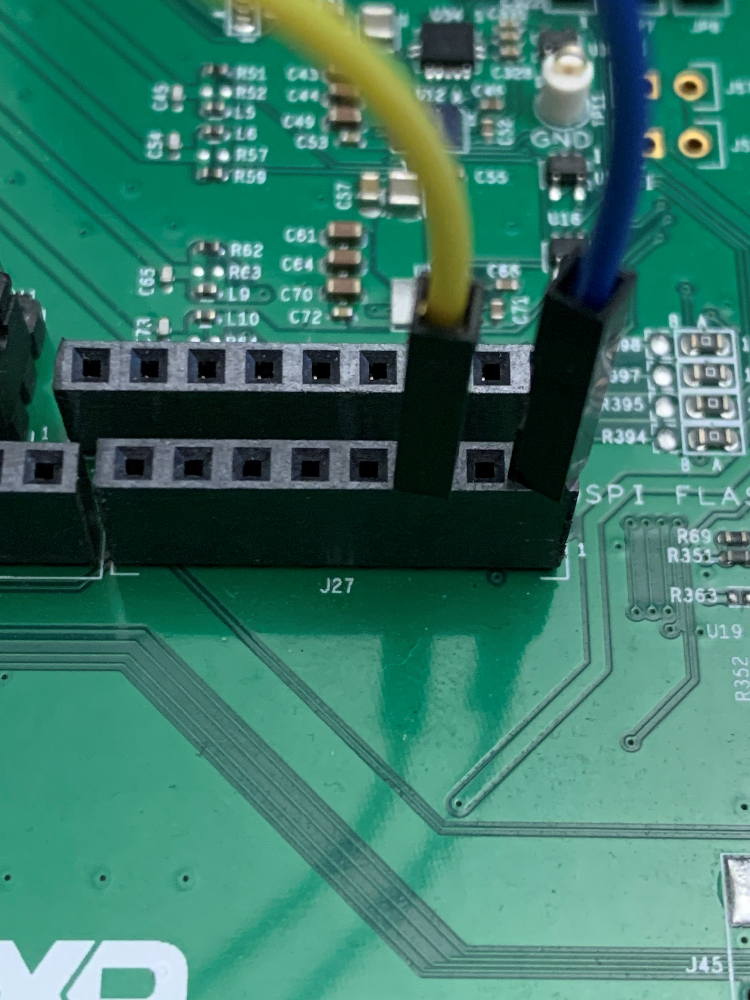

Finally connect the black (GND) and red (5V) wires to the J29 female header on the RT685-EVK like so:
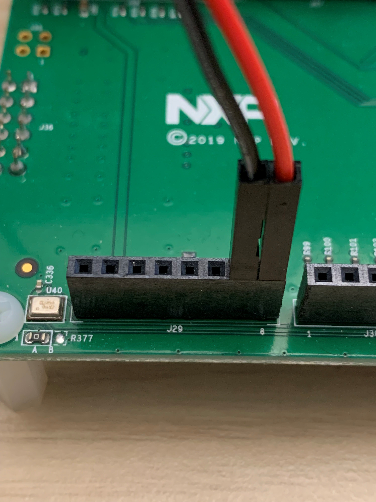

## Power up
Connect the Micro-B end of the USB cable into the J5 (Link USB) header on the RT685-EVK:
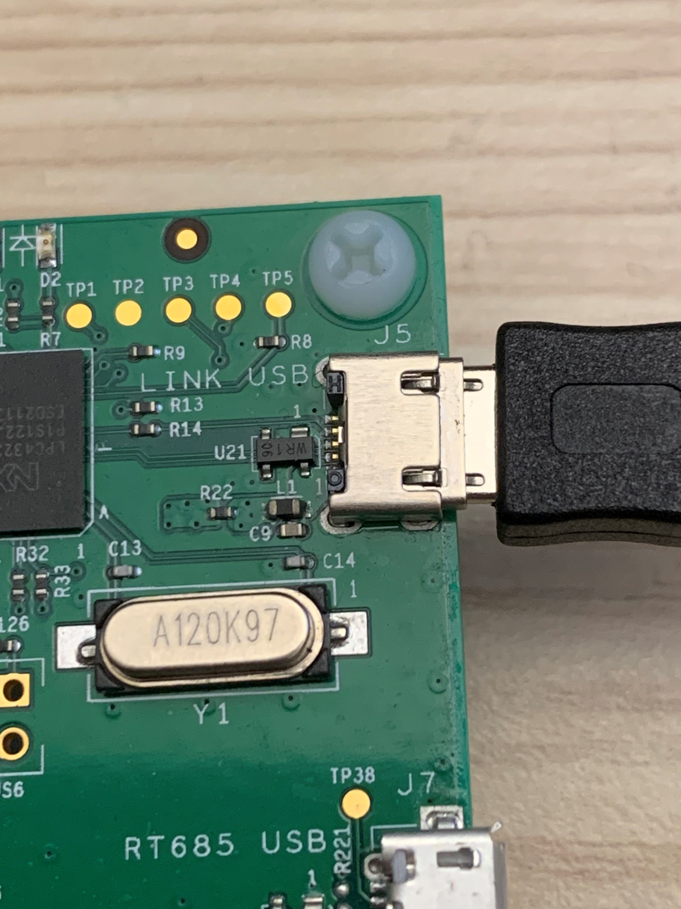

Double check all the connections described above, which should look like this:
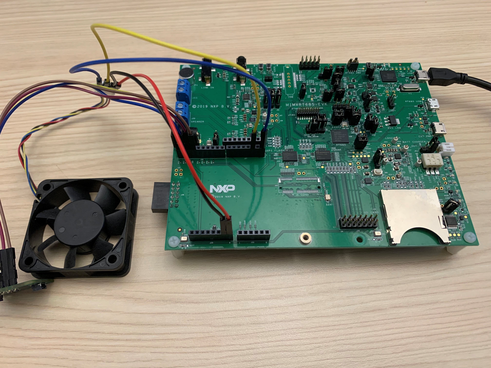

If everything looks good, connect the type-A end of the USB cable into a USB port on your work machine.

This will provide power, serial comms, and flashing capabilities.

## Flash and test
If the board is powered up correctly (you see LEDs lit up and nothing is smoking), from the `platform/winhec-demo` folder run `cargo run --release` from a PowerShell terminal.  This will build and flash the firmware.

Confirm that the tmp108 sensor reading makes sense (e.g. we see 24 C here at room temperature), which verifies the sensor is connected correctly:

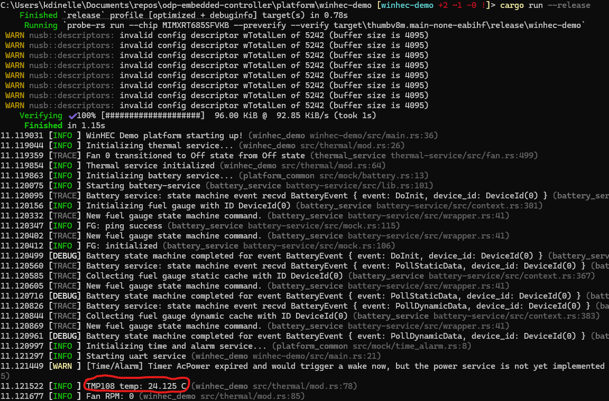

I recommend touching the sensor to apply heat until it is above 25 C, which will cause the fan to turn on to confirm the fan is correctly connected as well.  
If everything looks good, hit `Ctrl + C` to exit and detach probe-rs.  
The board is now ready to be connected to a host. Please see the [QEMU SBSA](https://github.com/OpenDevicePartnership/odp-platform-qemu-sbsa/tree/winhec) repo or [RADXA Orion O6](https://github.com/OpenDevicePartnership/odp-platform-radxa-orion-o6) repo
for further instructions to connect to the board from those platforms.